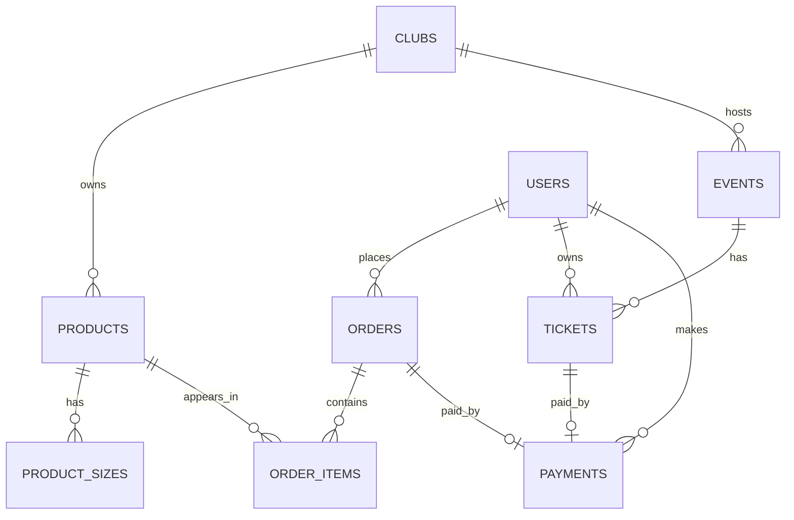

# AIU Student Club Merch & Event Ticket Store

## Purpose

This PHP and MySQL web application lets AIU students buy club merchandise and reserve event tickets. Club administrators manage stock, events, orders, payments, reports, and ticket entry.

## Technology

- Frontend: HTML and CSS
- Backend: PHP with MySQLi
- Database: MySQL/MariaDB through phpMyAdmin
- Local server: XAMPP

## User roles

| Role | Access |
|---|---|
| Student | Register, log in, shop, checkout, book tickets, view own orders and tickets |
| Club admin | All student actions plus dashboard, products, sizes, events, payments, reports, and check-in |
| Super admin | Same access as club admin |

## Main database relationships

## Important pages

- `index.php` — home page
- `shop.php` and `cart.php` — merchandise flow
- `events.php` and `book_ticket.php` — ticket flow
- `account.php` — student order and ticket history
- `admin.php` — administrator dashboard
- `admin_orders.php` — payment and order status management
- `ticket_checkin.php` — ticket validation at event entry
- `admin_reports.php` — sales and attendance summary

## Security measures included

- Passwords are stored using `password_hash()`.
- Login uses `password_verify()`.
- Admin pages require a valid admin role.
- SQL writes use prepared statements.
- Ticket codes are generated with `random_bytes()`.
- Product uploads accept only JPG, PNG, and WebP files up to 2 MB.

## Future improvements

- M-Pesa payment integration
- QR-code image generation and scanner support
- Email ticket receipts
- Product quantity controls in the cart
- Club-specific admin permissions
